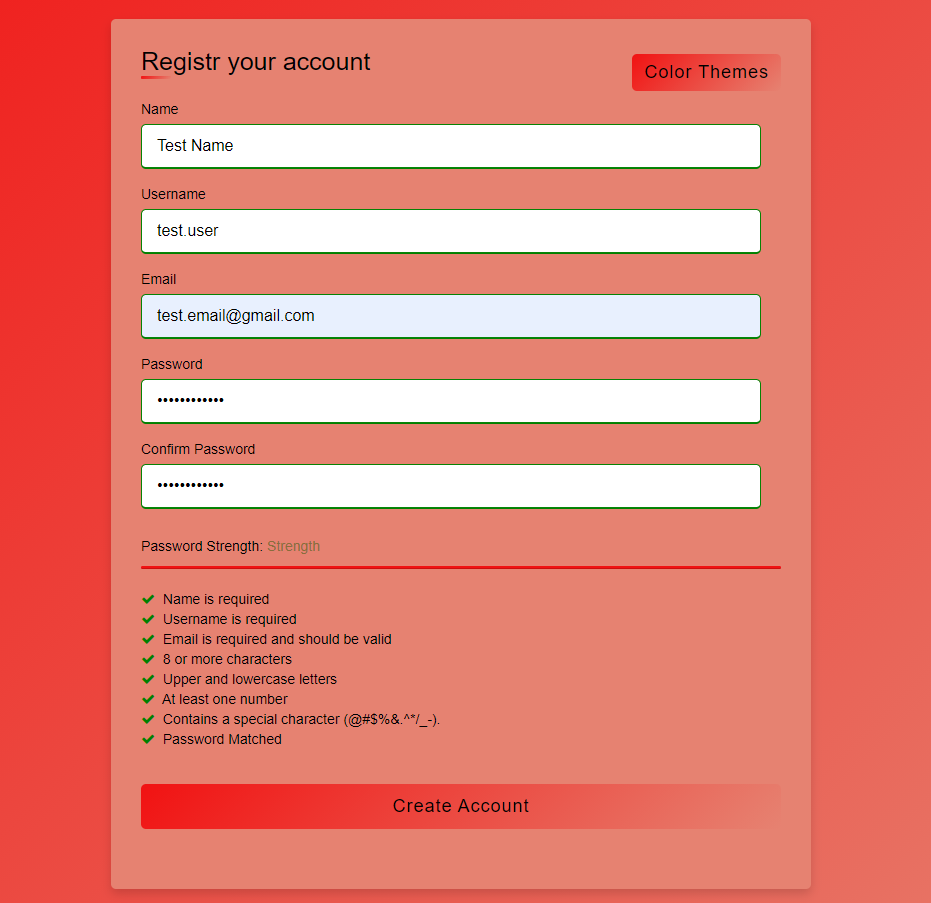
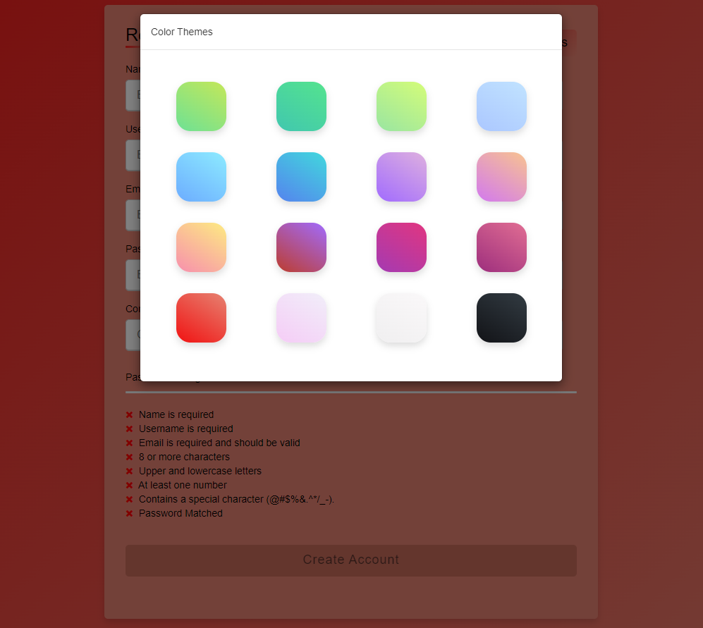
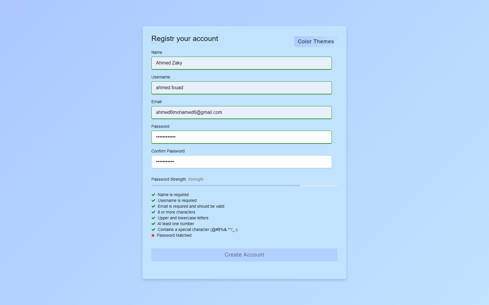
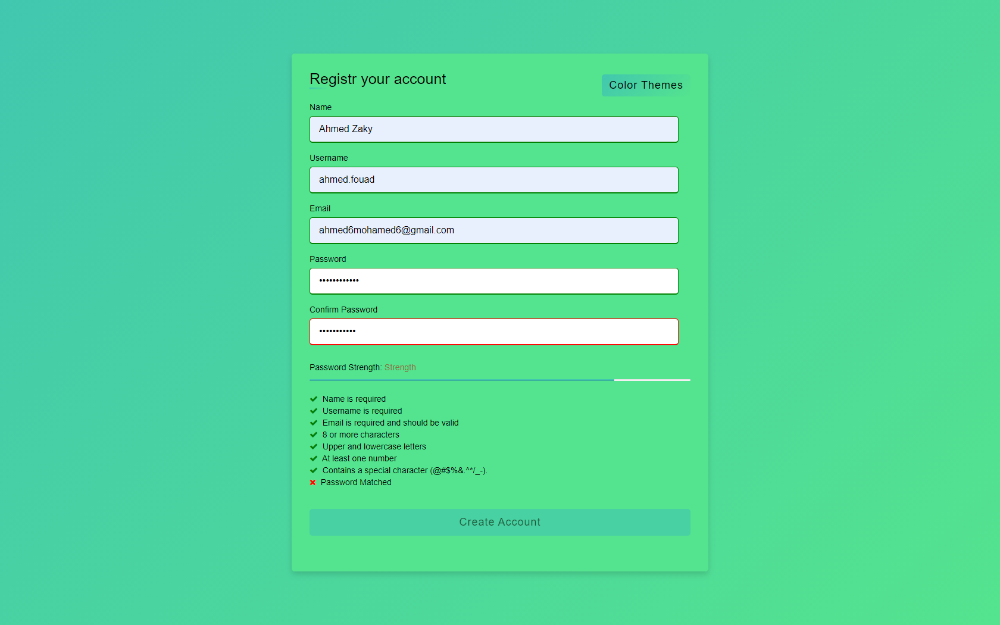
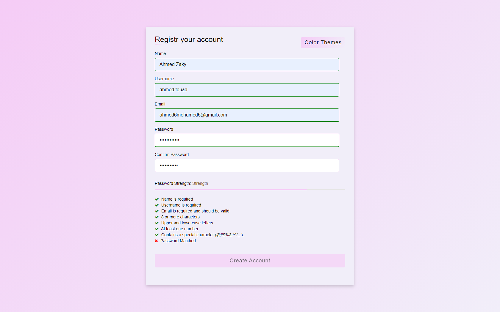
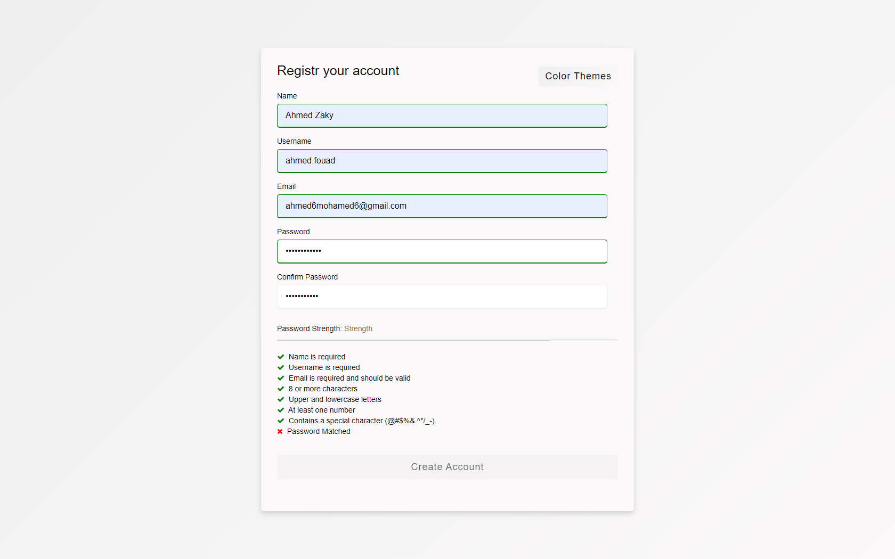

# FormRegistrationWithProgressbar

Form Registration (HTML &amp; CSS &amp; JS &amp; Bootstrap)

  

  

  

  

  

  

  <strong>And more ...</strong>

### Has the Following Features:

* Reactive Input Validation
* Input Fields Checker Block
* Password Strength Progress bar checker
* Color Themes for the entire Register page

### Project Files Structure:

.  
├── index.html              
├── script.js  
├── style.css  
└── README.md

### HTML Content

* The Container
* Color Themes Button which opens a Modal to choose a color theme
* Validatable Input Fields
* Progress Bar for Password Strength Checker
* Form Inputs Checker Block
* Submit Button which is disabled until Form is Fully Validated

### Javascript Content

> The Following is Declaring the Content of the Javascript File from Beginning until the end. 

* Coloer Themes Handler   
    * Coded From Line ~ 3 - 170 
* Disable Submit (Create Account) Button By Default
    * Coded From Line ~ 170 -172
* Required Fields (Name - Username - Email) Validation
    * Coded From Line ~ 175 - 177
* Email Field Validation
    * Coded From Line ~ 202 - 225
* Validate Password and Confirm Password
    * Password Event Listener
        * Coded From Line ~ 229 - 2304
    * Confirm Password Event Listener
        * Coded From Line ~ 236 - 244
    * Password/Confirmation Helper Methods
        * Coded From Line ~ 246 - 380
* Check all Inputs Validation Before Submission
    * Coded From Line ~ 381 - 392
* Speed up the Progress bar to be faster than default settings
    * Coded From Line ~ 394 - 396

### CSS Content

> The CSS Content is Divided into two main Sections  
> 1. Color themes Section From Line ~ 1 - 143.
> 2. Form and Password Checker Styles From 143 until the end of the styles sheet.
